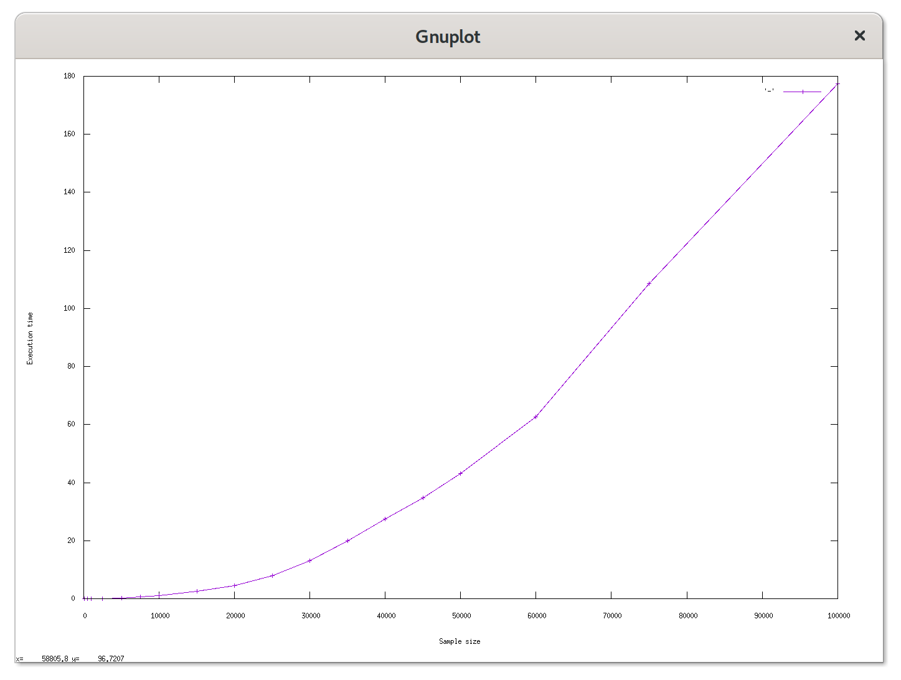

# Case-study оптимизации

## Актуальная проблема
В нашем проекте возникла серьёзная проблема.

Необходимо было обработать файл с данными, чуть больше ста мегабайт.

У нас уже была программа на `ruby`, которая умела делать нужную обработку.

Она успешно работала на файлах размером пару мегабайт, но для большого файла она работала слишком долго, и не было понятно, закончит ли она вообще работу за какое-то разумное время.

Я решил исправить эту проблему, оптимизировав эту программу.

## Формирование метрики

Для того, чтобы понимать, дают ли мои изменения положительный эффект на быстродействие программы я придумал
использовать такую метрику: время выполнения скрипта для заданного размера выборки.

Бюджет на метрику задан в условиях задачи: 30 секунд на выполнение большого файла.

## Выбор начального размера выборки и беглый анализ асимптотики

Т.к. на референсном файле скрипт вообще не завершал работу за обозримое время, я решил выбрать начальный размер
выборки (первые N строк из референсного файла) для первых шагов оптимизации. Размер выборки должен быть достаточно
большим, чтобы успешные изменения в скрипте приводили к обозримым изменениям времени выполнения, при этом время
выполнения не должно быть слишком большим (чтобы не тормозить `feedback-loop`).

Для этого я распаковал `data_large.txt.gz` в директорию `samples/`:

``` sh
$ unar data_large.txt.gz -o samples
```

Скрипт `bin/bench`, который принимает размер выборок для замера времени выполнения, генерирует при необходимости
выборки из `samples/data_large.txt` (можно было изменить метод `#work` так, чтобы он принимал
необязательным параметром размер выборки `size` и лениво читал только первые `size` строк из
`samples/data_large.txt`, но я решил не вносить лишние изменения в скрипт).

Я запустил `bin/bench` для некоторых размеров выборки:

``` sh
$ bin/bench \
    100 500 1000 2500 5000 7500 10000 15000 20000 25000 \
    30000 35000 40000 45000 50000 60000 75000 100000
```

Полученные результаты отражены в следующей таблице:

| Размер выборки | Время выполнения, сек. |
|----------------|------------------------|
| 100            | 0.0013                 |
| 500            | 0.0094                 |
| 1000           | 0.0225                 |
| 2500           | 0.0976                 |
| 5000           | 0.3210                 |
| 7500           | 0.6618                 |
| 10000          | 1.1617                 |
| 15000          | 2.6372                 |
| 20000          | 4.5404                 |
| 25000          | 8.0533                 |
| 30000          | 13.2555                |
| 35000          | 19.8822                |
| 40000          | 27.4196                |
| 45000          | 34.7722                |
| 50000          | 43.2001                |
| 60000          | 62.7231                |
| 75000          | 108.6105               |
| 100000         | 177.3695               |

Я решил выбрать 20000 в качестве изначального размера выборки, т.к. для него скрипт выполняется меньше 5 секунд, да
и число круглое.

Для визуализации данных я решил нарисовал график зависимости времени выполнения от размера выборки
с помощью скрипта `bin/plot`, который парсит вывод `bin/bench`:

``` sh
$ bin/bench ... | tee /dev/tty | bin/plot
```

Полученный график:



По данным и графику видно, что зависимость времени выполнения от размера выборки _похожа_ на квадратичную. Попробуем
оценить время выполнения оригинального скрипта для файла `samples/data_large.txt`, сравнив со временем выполнения
для размера выборки 100000:

``` sh
$ wc -l samples/data_large.txt
3250940 samples/data_large.txt
$ irb
irb(main):001:0> factor = 3250940.0 / 100000
irb(main):002:0> (factor * factor * 177.3695).round
=> 187455
```

Итого получилось ~187455 секунды, или примерно 52 часа.

## Гарантия корректности работы оптимизированной программы
Программа поставлялась с тестом. Выполнение этого теста в фидбек-лупе позволяет не допустить изменения логики программы при оптимизации.

## Feedback-Loop
Для того, чтобы иметь возможность быстро проверять гипотезы я выстроил эффективный `feedback-loop`, который позволил мне получать обратную связь по эффективности сделанных изменений за 5-10 секунд.

Вот как я построил `feedback-loop`: *как вы построили feedback_loop*

## Вникаем в детали системы, чтобы найти главные точки роста
Для того, чтобы найти "точки роста" для оптимизации я воспользовался *инструментами, которыми вы воспользовались*

Вот какие проблемы удалось найти и решить

### Ваша находка №1
- какой отчёт показал главную точку роста
- как вы решили её оптимизировать
- как изменилась метрика
- как изменился отчёт профилировщика - исправленная проблема перестала быть главной точкой роста?

### Ваша находка №2
- какой отчёт показал главную точку роста
- как вы решили её оптимизировать
- как изменилась метрика
- как изменился отчёт профилировщика - исправленная проблема перестала быть главной точкой роста?

### Ваша находка №X
- какой отчёт показал главную точку роста
- как вы решили её оптимизировать
- как изменилась метрика
- как изменился отчёт профилировщика - исправленная проблема перестала быть главной точкой роста?

## Результаты
В результате проделанной оптимизации наконец удалось обработать файл с данными.
Удалось улучшить метрику системы с *того, что у вас было в начале, до того, что получилось в конце* и уложиться в заданный бюджет.

*Какими ещё результами можете поделиться*

## Защита от регрессии производительности
Для защиты от потери достигнутого прогресса при дальнейших изменениях программы *о performance-тестах, которые вы написали*
